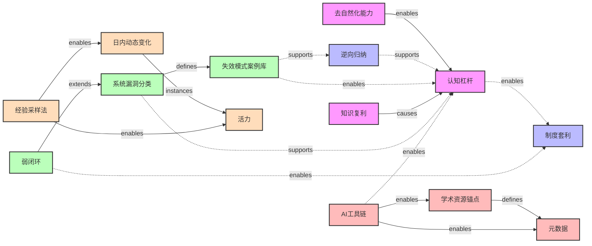

# 知识图谱可视化

基于 `wiki/relations.json` 自动生成，仅显示强度 >= 0.8 的关系。

```mermaid
graph LR
  classDef cognition fill:#f9f,stroke:#333,stroke-width:2px
  classDef strategy fill:#bbf,stroke:#333,stroke-width:2px
  classDef systems fill:#bfb,stroke:#333,stroke-width:2px
  classDef knowledge-engineering fill:#fbb,stroke:#333,stroke-width:2px
  classDef psychology fill:#fdb,stroke:#333,stroke-width:2px

  去自然化能力:::cognition -->|enables| 认知杠杆:::cognition
  逆向归纳:::strategy -.->|supports| 认知杠杆:::cognition
  失效模式案例库:::systems -.->|enables| 认知杠杆:::cognition
  知识复利:::cognition -->|causes| 认知杠杆:::cognition
  系统漏洞分类:::systems -.->|supports| 认知杠杆:::cognition
  认知杠杆:::cognition -.->|enables| 制度套利:::strategy
  弱闭环:::systems -.->|enables| 制度套利:::strategy
  弱闭环:::systems -->|extends| 系统漏洞分类:::systems
  系统漏洞分类:::systems -->|defines| 失效模式案例库:::systems
  失效模式案例库:::systems -.->|supports| 逆向归纳:::strategy
  
  学术资源锚点:::knowledge-engineering -->|defines| 元数据:::knowledge-engineering
  AI工具链:::knowledge-engineering -->|enables| 学术资源锚点:::knowledge-engineering
  AI工具链:::knowledge-engineering -->|enables| 元数据:::knowledge-engineering
  AI工具链:::knowledge-engineering -.->|enables| 认知杠杆:::cognition
  
  经验采样法:::psychology -->|enables| 日内动态变化:::psychology
  日内动态变化:::psychology -->|instances| 活力:::psychology
  经验采样法:::psychology -->|enables| 活力:::psychology
```
